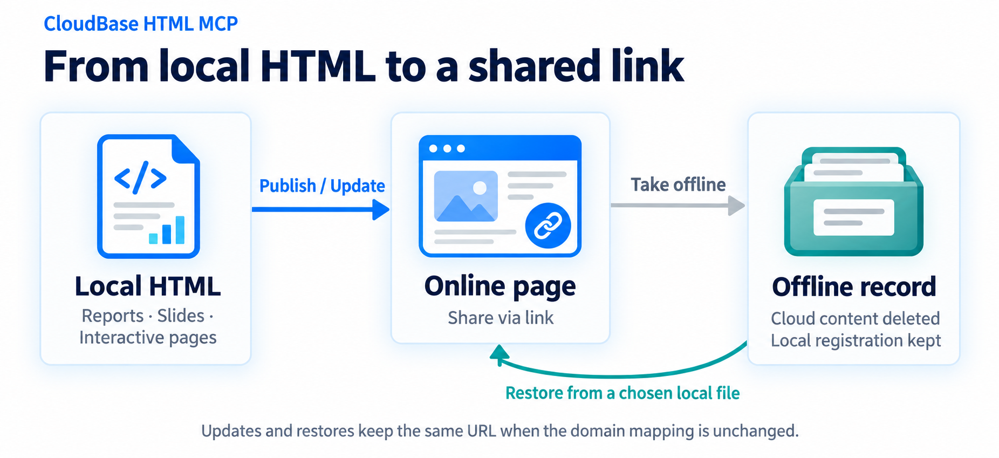

# CloudBase HTML MCP

[简体中文 — primary documentation](README.md) | English overview

A local STDIO MCP server that lets your desktop AI agent publish a designated HTML file to your CloudBase environment, update the same URL, take a site offline and restore it from a local file.

The motivation is simple: share an agent-generated report, demo or interactive page, keep updating the same link, and take it offline or restore it when needed. The workflow focuses on single HTML files, desktop MCP clients and an administrator-provided configuration file; it needs no separate remote MCP service. See the [scenarios and lifecycle diagram](README.md#典型场景) in the Chinese README.

[CloudBase](https://cloudbase.net/) is Tencent Cloud's application development platform. This tool uses its static hosting and environment authentication for one focused workflow: publishing a single local HTML file to your own environment. Cloud service charges are separate from the MIT-licensed tool. See the [Chinese positioning notes](PROJECT.md#positioning-and-related-tools) for related projects and scope.

<!-- release:version -->
**Prerelease version: 0.5.0-beta.1.** Node.js 22+ is required; the package does not bundle Node. Release and acceptance evidence is recorded in [verification status](PROJECT.md#v05-release). Earlier desktop evidence does not establish acceptance of a newer version.
<!-- /release:version -->

This release adds optional site names, HTML titles and local keyword search, plus structured static-resource diagnostics on publish/restore. It still uploads only the original HTML. **Available on npm under the beta tag**; use the pinned version in the client configuration. See the [Chinese guide](docs/getting-started.md#resource-diagnostics) for scope and upgrade notes.

## Workflow

`publish_html` publishes or updates an online page; `offline_html` deletes cloud content while keeping its registration; `online_html` restores the site from the file you specify. Updates and restoration keep the original URL when the domain mapping is unchanged. Editing the local file alone does not update the online page.

## Setup

Receive a completed `credentials.env` from your administrator and place it at `.config/cloudbase-html-mcp/credentials.env` under your home directory. Then add the MCP using the appropriate client configuration, reload it, and run `hosting_status` and `list_html`. Administrator-issued Keys require no CloudBase login.

- [Getting started (Chinese)](docs/getting-started.md): configuration placement, source/local package installation, optional wizard and troubleshooting.
- [Desktop clients (Chinese)](docs/clients.md): JSON and command forms for macOS and Windows.
- [Architecture (Chinese)](docs/architecture.md): six-tool contracts and lifecycle sequences.

Only one UTF-8 HTML file, up to 20 MiB, is uploaded; associated local assets are not included. Offline operations delete cloud content, and restoration requires the local file and registration. Storage success and public accessibility are reported separately. Setup itself publishes nothing.

The full documentation is maintained in Chinese. This page is a brief overview, not a parallel translation.

## License

[MIT](LICENSE). Dependencies retain their own licenses. This is an independent project, not an official Tencent Cloud product.
