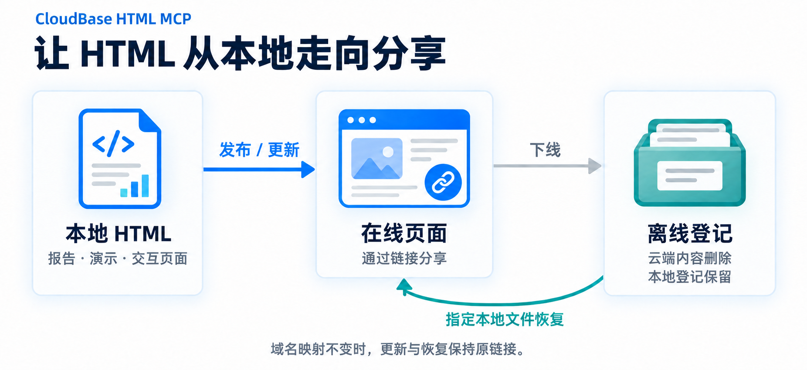

# CloudBase HTML MCP

简体中文 | [English](README.en.md)

**让 Agent 做好的 HTML，成为一个可以分享、持续更新的链接。**

CloudBase HTML MCP 面向国内桌面 Agent 用户，将本地报告、演示或交互页面发布到自己的 CloudBase 环境。修改后更新原链接，需要时下线，再从指定的本地文件恢复。

本地 STDIO MCP · 六工具 · MIT · 当前测试版 `0.4.0-beta.5`。[验证状态](PROJECT.md#v04-验证与发布安排)

<a id="为什么做这个工具"></a>
## 为什么选择它

Agent 已经做好了页面，分享却还要传附件、解释如何打开、手动上传和管理链接。这个工具把这些后续操作接回对话，让使用者继续专注于内容。

- **专注单 HTML**：围绕发布、同链接更新、查询、下线和恢复提供六项操作；不要求为每份产物建立工程或配置构建流程。
- **适配桌面 Agent**：通过本地 STDIO MCP 接入，提供中文指南和可复制的 JSON。管理员准备好环境及配置文件后，使用者完成一次客户端接入即可在对话中操作，无需登录 CloudBase 控制台。
- **本地产物与自己的云环境**：HTML 源文件留在本地，内容发布到自己的 CloudBase 静态托管；无需另行部署远程 MCP 服务或业务数据库。

[CloudBase（腾讯云开发）](https://cloudbase.net/) 提供云端托管能力。本项目聚焦已有单页产物的分享与管理；与通用 CLI、其他发布工具的关系见 [定位与相近工具](PROJECT.md#positioning-and-related-tools)。

## 典型场景

| 你已有的产物与需求 | 对 Agent 说什么 | 得到什么 |
| --- | --- | --- |
| 一份分析报告或 HTML 演示，准备分享 | “把这份 HTML 发布，给我链接和验证结果。” | 接收者通过链接查看，无需接收本地文件附件。 |
| 原型、计算器或说明页需要反复修改 | “把修改后的文件更新到原链接。” | 已分享的入口保持不变，再次发布后呈现新内容。 |
| 临时展示结束，之后还会再次使用 | “下线这个页面”；再次使用时指定本地文件恢复。 | 云端内容删除，本地登记保留，可恢复原站点。 |



`publish_html` 发布或更新在线页面；`offline_html` 删除云端内容并保留登记；`online_html` 从本次指定的本地文件恢复。

`hosting_status` 检查接入，`get_html` 查询单页，`list_html` 查看本地已知站点。域名映射不变时，更新和恢复保持 URL 不变；公网验证与存储成功分别报告，默认域名可能有预览限制，见 [适用范围](#适用范围)。

## 快速接入

主线是 **Node.js 22+ → 放好配置文件 → 粘贴 MCP JSON → 验证**。

1. 准备 [Node.js 22+](docs/getting-started.md#prepare-node)。
2. 领取管理员填好的 `credentials.env`，放到用户主目录的 `.config/cloudbase-html-mcp/credentials.env`；自行配置请看 [获取 API Key](docs/getting-started.md#get-cloudbase-api-key) 和 [文件放置说明](docs/getting-started.md#for-the-recipient)。
3. 在客户端的 JSON 导入或 MCP 配置编辑器中，按操作系统使用下面的配置。已有 `mcpServers` 时只合并 `cloudbase_html` 条目，保留其他连接器；这个 JSON 不需要填 Key。

**macOS** · [JSON 文件](templates/mcp.macos.json)

```json
{
  "mcpServers": {
    "cloudbase_html": {
      "command": "npx",
      "args": ["-y", "cloudbase-html-mcp@0.4.0-beta.5", "serve"]
    }
  }
}
```

**Windows** · [JSON 文件](templates/mcp.windows.json)

```json
{
  "mcpServers": {
    "cloudbase_html": {
      "command": "cmd.exe",
      "args": ["/d", "/c", "npx", "-y", "cloudbase-html-mcp@0.4.0-beta.5", "serve"]
    }
  }
}
```

WorkBuddy、千问办公和 QoderWork 的入口与依据见 [客户端指南](docs/clients.md#json-import--json-导入)。豆包工作目前按已确认的 STDIO 表单填入对应 `command` 和 `args`；不要把整段 JSON 粘到“命令”框。

保存并重载 MCP，然后让 Agent 调用 `hosting_status`、`list_html` 验证。确认目标环境后，即可说：

> 将 `/absolute/path/report.html` 发布到我配置的 CloudBase 环境，给我链接和验证结果。

详见 [快速开始](docs/getting-started.md)。[源码或本地包](docs/getting-started.md#install-from-source-or-a-local-package) 和可选终端向导适合开发与排错。

## 工具

| 工具 | 用途 |
| --- | --- |
| `hosting_status` | 检查凭据/托管，报告配置来源与登记设置；此检查不验证上传和删除权限。 |
| `publish_html` | 发布指定本地 HTML，或更新在线页面。 |
| `get_html` | 按 ID、URL 或登记路径查询，包括云端内容与公网验证。 |
| `list_html` | 列出本地已知站点及最近确认状态。 |
| `offline_html` | 删除当前云端 HTML 和旧快照，保留本地登记。 |
| `online_html` | 从本次明确指定的文件恢复已登记离线站点。 |

更新或下线前先查询并传入返回的哈希。详见 [示例](docs/getting-started.md#6-first-use) 和 [工具契约](docs/architecture.md#3-工具契约)；MCP 工具发现也会提供参数说明。

## CloudBase 在这里做什么

本工具使用 CloudBase 的 [静态网站托管](https://docs.cloudbase.net/hosting/web-hosting-static) 和环境 API Key 认证，上传 HTML 并核对路由与公网访问结果。MCP 在用户电脑上运行，云端使用已配置的托管资源。工具采用 MIT 开源，CloudBase 套餐、存储和流量费用另按云服务规则计算。

<a id="发布前须知"></a>
## 适用范围

- 上传单份非空 UTF-8 `.html`/`.htm` 文件，最多 20 MiB；关联的本地图片、CSS、JS 不会一起上传，发布前应确认页面可独立使用。
- 发布产生公网访问链接。本工具不提供读者登录、密码保护或协同编辑；请发布适合通过公网链接分享的内容。
- 本地文件是内容来源。不备份 HTML、不新增项目快照；列表/下线/恢复依赖本地登记，不跨机器同步。
- 下线删除云端内容，保留本地文件才能恢复；不清除浏览器/CDN 缓存。COS 原生版本控制启用、暂停或无法核实时，会阻止破坏性清理。
- 存储成功与公网验证分开。默认域名可能出现提示页或触发下载；`PUBLISHED_PREVIEW` 表示内容一致但有预览限制，正式分享体验见 [状态说明](docs/getting-started.md#update-an-existing-page)。

## 文档与开发

- [快速开始](docs/getting-started.md)：管理员/收件人流程、API Key、JSON 接入、可选向导及排错。
- [桌面客户端](docs/clients.md)：手工接入格式、客户端差异与实际兼容性状态。
- [架构说明](docs/architecture.md)：配置、契约、生命周期时序及验证。
- [旧快照清理](docs/getting-started.md#existing-v02-installations) · [项目边界与验证状态](PROJECT.md)。

```sh
npm ci --ignore-scripts
npm run test:prepare
npm run check
npm test
```

`test:prepare` 联网准备独立 npm 测试缓存；`npm test` 离线，包含真实 STDIO 子进程及本地安装包测试，云端使用替身。依赖变更或缓存清理后重新准备。CI 与桌面客户端、真实云端验收分开记录。

## 许可证

[MIT](LICENSE)。依赖遵循各自许可证。本项目为独立工具，不是腾讯云官方产品。
