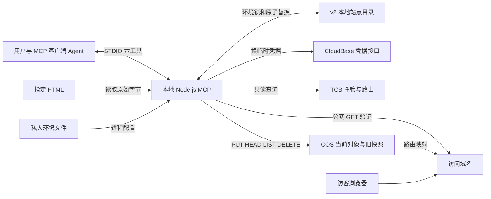
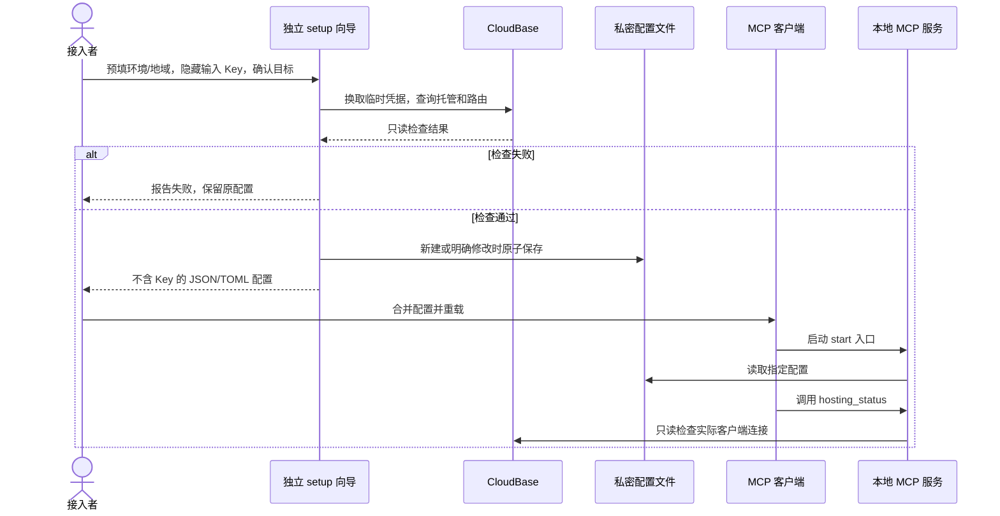
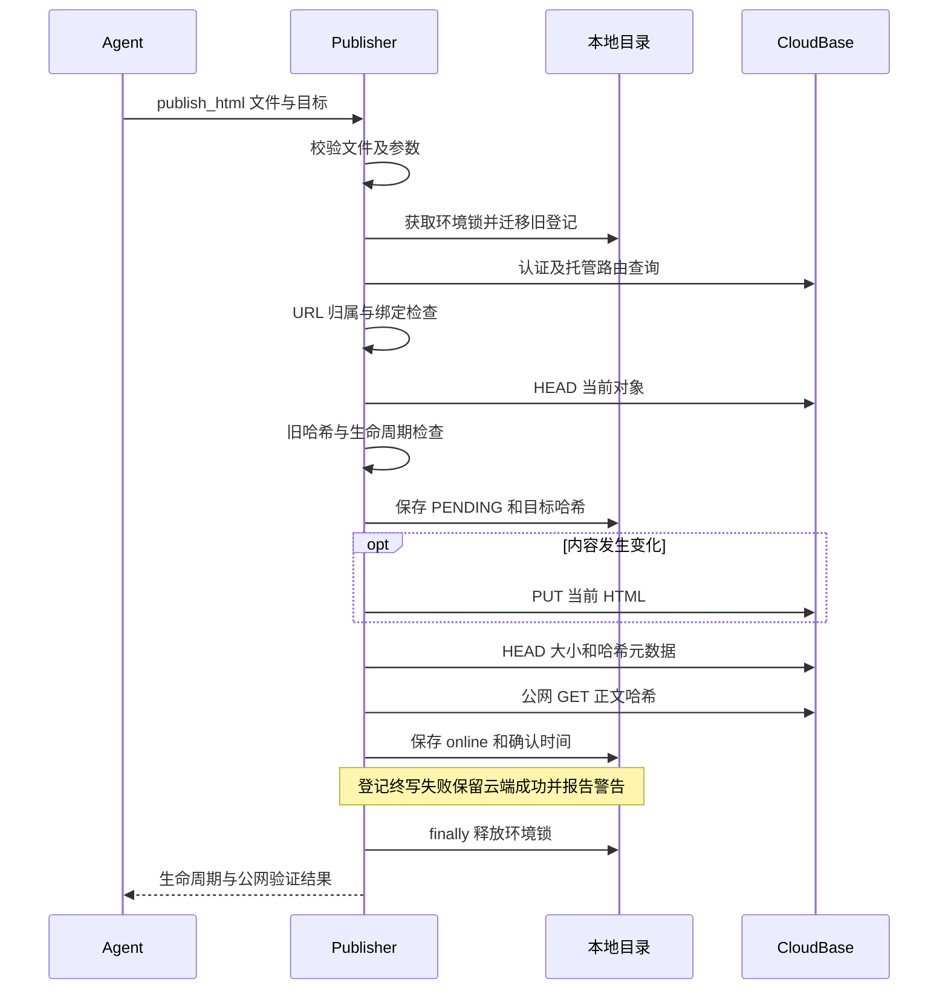
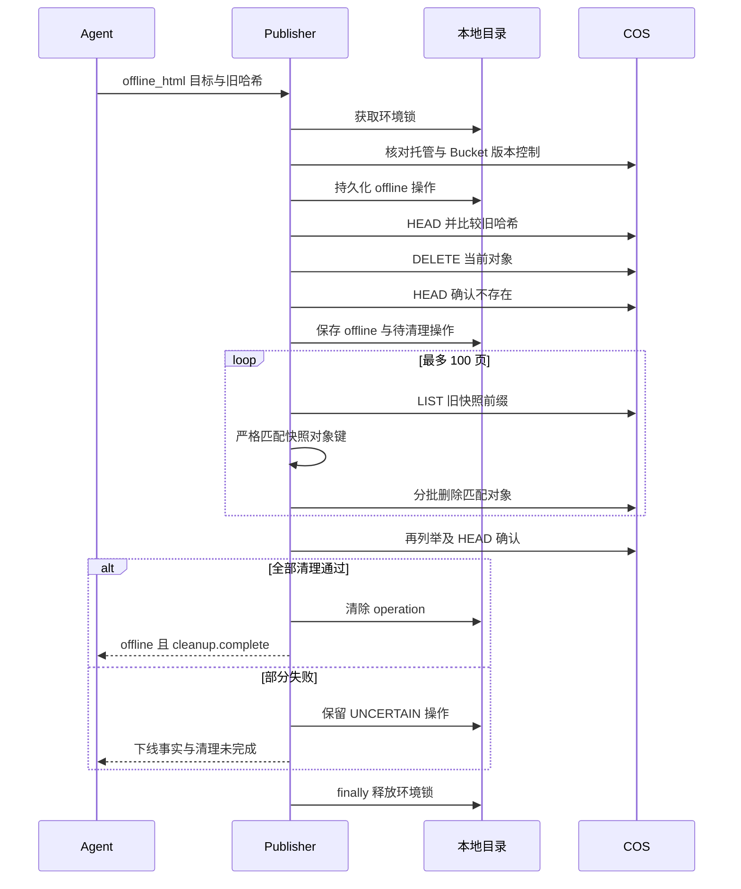
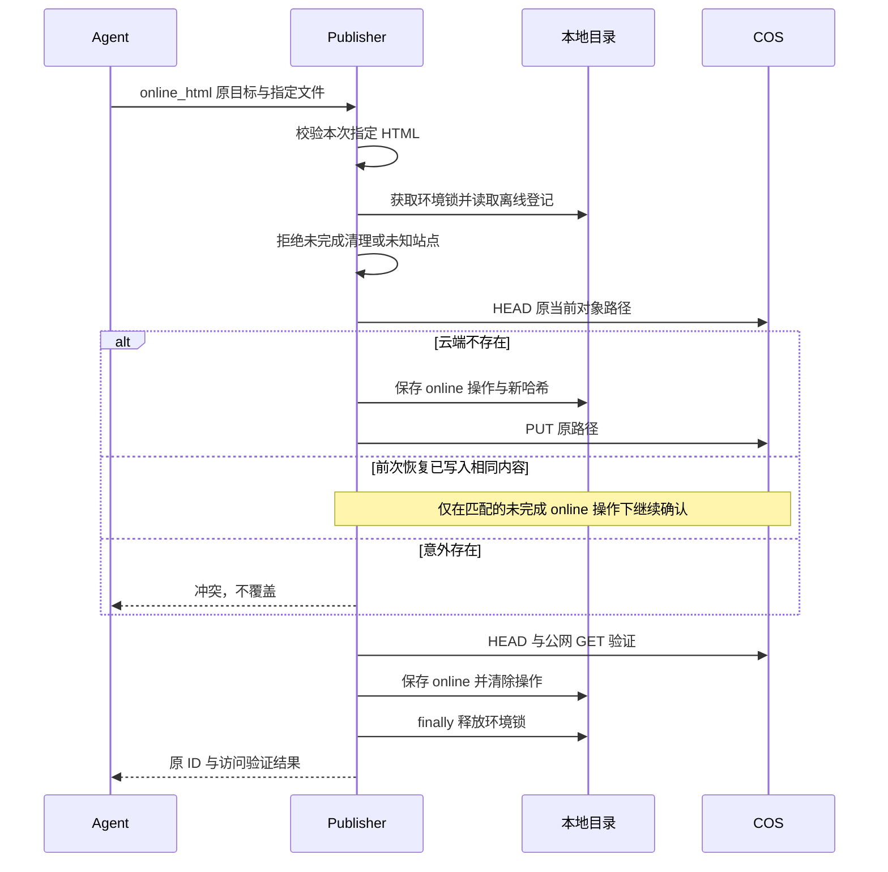

# 架构说明与关键时序

本文描述 v0.3 已实现的结构。人可从图理解流程，Agent 可从职责和契约定位源码。接入见 [快速开始](getting-started.md)，完整对外说明见 [README](../README.md) 与 [中文 README](../README.zh-CN.md)。

## 1. 总览

本地产物是内容来源，MCP 只读用户指定的 HTML；COS 保存当前对象。本地目录保存站点元数据，不保存 HTML。浏览器直接访问 CloudBase，不经过 MCP。

六工具不缩小环境 API Key 的实际权限；不会自动切换环境、创建资源、更改域名或 Bucket 设置。HTML 是数据，不执行其中的指令。STDIO stdout 只承载协议。

## 2. 组件和入口

| 模块 | 职责 |
| --- | --- |
| [server.mjs](../src/server.mjs) | 六工具 schema、逐参数说明、协议返回和错误恢复；真实路径入口判断支持符号链接。 |
| [setup.mjs](../scripts/setup.mjs) / [向导逻辑](../src/setup.mjs) | 独立交互式 CLI，环境/地域预填、隐藏输入 API Key、只读检查、生成客户端配置；不占用 MCP STDIO，不自动修改客户端。 |
| [config-file.mjs](../src/config-file.mjs) / [start.mjs](../scripts/start.mjs) | 仓库外私密文件读取与原子保存；生成的启动入口显式加载指定文件，替换继承的 CloudBase 配置。 |
| [publisher.mjs](../src/publisher.mjs) | 文件验证、目标解析协调、当前对象发布、下线、恢复、列表与公网验证。 |
| [registry.mjs](../src/registry.mjs) | v2 站点目录、v1 兼容迁移、环境级锁、路径绑定和未完成操作。 |
| [domains.mjs](../src/domains.mjs) | 网关发现、候选筛选、规范 URL 解析与当前环境归属校验。 |
| [cloudbase.mjs](../src/cloudbase.mjs) | 配置、临时凭据、官方 TCB/COS SDK 适配、版本控制闸门、分页与逐对象删除结果检查。 |
| [cleanup.mjs](../src/cleanup.mjs) | 严格旧快照路径过滤、清理、只读清单和按清单执行；无自动全桶清理。 |
| [recovery.mjs](../src/recovery.mjs) / [errors.mjs](../src/errors.mjs) | 结构化错误与下一步建议；建议不等于自动重试引擎。 |
| [call.mjs](../scripts/call.mjs) / [cleanup-snapshots.mjs](../scripts/cleanup-snapshots.mjs) | 一次性协议客户端、默认只读的旧快照清理 CLI。 |

服务按首次需要配置的调用创建 Publisher。缺失凭据时可以列举工具，调用返回 CONFIG_REQUIRED 及 setup_guide，其中 local_setup 引导用户在真实终端运行向导。生成的 start.mjs 入口在文件不存在或私密保护检查失败时先退出，仅写 stderr。原 src/server.mjs 环境变量入口仍兼容，原生 --env-file 不存在时由 Node 先退出。list_html 不调用云端，但仍使用当前配置环境。

### 本地接入设置时序

管理员提供环境 ID、地域及 API Key，接收者无需 CloudBase 账号登录。向导不使用继承的 CloudBase 环境变量作为隐式输入；连接 JSON 仅允许 envId、region。已有文件默认复用，edit 才修改，旧 Key 和可选配置可保留。确认目标后，只读检查成功才保存；失败/取消保留原文件。原子替换前使用排他文件锁并比较原内容，避免多个向导互相覆盖；崩溃遗留锁需人工核对后清理。配置路径先按文件系统解析目录符号链接，再处理父目录语义，检查与读写统一使用物理目标；缺失目录后的 .. 无法明确定位时拒绝，不静默改指相邻文件。文件不进入 Git，POSIX 私密目录 0700、文件 0600；Windows ACL 由用户管理。

向导的连接检查与 hosting_status 复用 CloudBase.connect；只证明凭据和托管在线，域名发现状态另报，上传/删除和公网 HTML 均未测试。JSON/TOML 只包含本地路径；不写 API Key 到参数、协议结果或配置片段。配置文件读取会清除继承的同名及缺失可选 CloudBase 变量；旧的 Node 原生 --env-file 模式仍遵循环境变量优先语义。

## 3. 工具契约

| 工具 | 输入 | 副作用与结果 |
| --- | --- | --- |
| hosting_status | 无 | 只读托管/路由；管理目录版本与是否启用；上传/删除权限不冒充已测。 |
| publish_html | localPath；可选 siteId 或 siteUrl、expectedSha256、newPage | 新建或更新在线对象；返回哈希、URL、写入/登记/公网验证结果，不返回新的 versionKey。 |
| get_html | siteId、siteUrl、localPath 三选一 | 查询真实云端；不回写本地目录；返回 observedStorage、生命周期与登记中的未完成操作。 |
| list_html | lifecycle、offset、limit | 只读当前环境本地目录；默认 50，最大 100；结果有总数和 nextOffset。 |
| offline_html | 一个选择器及 expectedSha256 | 删除当前对象及严格匹配的旧快照；保留登记，分开返回生命周期和清理完成度。 |
| online_html | siteId 或 siteUrl，另带 localPath | 已登记离线站点恢复；不从旧快照读取内容。 |

localPath 必须为绝对 .html/.htm 文件、非空有效 UTF-8、最多 5 MiB；用 HTML 标签作基本检测，不是完整解析器。只上传原始字节，相对资源仅告警。

在线更新必须带 get_html 返回的实际旧哈希。newPage=true 不与 ID/URL 同传；原站点保留，验证成功才切换路径绑定。无关路径绑定冲突会拒绝。离线站点不经 publish_html 隐式公开。

URL 只接受 HTTPS /sites/s-<32位小写十六进制>/ 或其 index.html，可带片段，不允许查询参数、凭据、转义路径、路径穿越。先检查原始拼写再解析，保留输入路径；随后分别核实输入路径和规范 index.html 路径均映射到当前环境静态托管资源。目录和文件可能命中不同路由，不能相互代替校验。无法确认时拒绝，不直接抓取任意输入 URL 或跟随重定向。合法 URL 使用其经核实的域名完成后续验证；ID/路径查询沿用域名候选选择。

get_html 对已知 ID 或已核实 URL 的本地元数据读取采用可选策略：REGISTRY 类读取错误通过 registryDiagnostic 返回，不阻断云端查询、不回写目录、不吞掉程序错误。元数据不可用且云端对象不存在时仍返回 SITE_NOT_FOUND，不据此认定 offline。按路径解析、列表及所有写操作保持严格目录依赖。

## 4. 本地与云端数据

- 当前对象：`sites/<siteId>/index.html`，更新覆盖同一路径；域名映射不变则 URL 不变。
- v0.3 不创建云端快照；旧版快照 `deployments/<siteId>/<sha256>/index.html` 只供指定范围清理。
- 默认登记目录：用户目录下 `.config/cloudbase-html-mcp/pages/`；可配置仓库外绝对目录或 off。
- 每环境/地域的文件名由二者哈希加 .catalog-v2.json 组成，内含 version、scope、sites 和 bindings。
- sites 按 siteId 保存 sha256、url、localPaths、sourcePaths、lifecycle、verifiedAt、updatedAt、state、operation。localPaths 从当前 bindings 生成，仅含可操作选择器；sourcePaths 是历史来源，不代表当前绑定或内容备份。
- bindings 保存规范化绝对路径的当前 siteId 和可选 pendingSiteId；当前与 pending 站点都在 sites 中保留。
- 文件 0600、新目录 0700；环境排他锁使用 wx，临时文件写入并 fsync 后 rename，站点记录与路径绑定一同提交。
- 本机同目录、同环境写入互斥；不同机器或不同目录不互斥，也不构成云端原子 CAS。

v1 哈希路径文件兼容只读；首次写操作持锁将其迁入 v2，旧文件保留但不再作为状态源。原绑定和 pending 均保留，相同站点合并路径；冲突哈希置为 null，保留 conflictingHashes，要求后续云端核对，不按遍历顺序选值。未核验旧记录 lifecycle 为 null。迁移后不要再运行 v0.2 写入者。

旧 v2 的 localPaths 可能混有历史路径：读取时将来源历史保留为 sourcePaths，并按 bindings 重建 localPaths；这一步只改变返回视图。持锁写入时原子保存规范化结果。pending 站点只有成为当前绑定后才获得该路径选择器，失败提升期间路径仍属于原站点。

lifecycle 只有 online/offline 两个业务值；null 代表尚无确认值。state 为 PENDING、UNCERTAIN、STORAGE_VERIFIED，operation 记录 publish/online/offline 的目标哈希和进度；它们不替代生命周期。列表是最近保存状态，查询则返回云端实际观察值，可能与登记不同。

## 5. 发布与更新时序

图省略错误分支的协议封装。云端 PUT 前先留恢复记录；写入超时不等于未写入。公网验证失败不重复上传，也不覆盖存储成功事实。HEAD 检查大小及上传时设置的哈希元数据，公网 GET 才对实际响应正文计算哈希。

首次新建失败保留预留 ID；替换路径的新建失败保持原绑定和 pending。查询 pending 确认云端存在后，可带其 ID 和当前哈希发布以验证并提升绑定；云端不存在不能冒充已发布。

## 6. 下线与清理时序

版本控制 Enabled、Suspended 或无法核实时，在任何删除前停止。预检查旧哈希冲突时恢复操作前登记，不留下错误的删除预期。已发出 DELETE 后结果不确定则保留原哈希，后续核对并重试；已有当前对象被其他写入者修改时仍拒绝删除。

每批最多 1000 个对象；只删除完整匹配旧路径格式的 index.html。分页游标必须前进，单次超过 100 页返回可恢复错误。批量响应即使 HTTP 成功，也检查逐对象错误/遗漏。清理后再核实当前对象不存在，检测其他写入者重建的情况。

删除不清除外部缓存，当前删除与公网旧内容不可访问不作同等承诺。部分清理不宣称全部空间回收。原生 Bucket 版本不是本项目快照，此工具不更改 Bucket 设置。

独立清理 CLI 默认只读输出精确清单；apply 校验环境、Bucket、站点、路径、ETag/大小，不删除清单外新增对象，不删除在线当前 HTML。执行使用同一个环境锁；无法协调其他机器，执行期间应避免其他写入者。

## 7. 原 ID 恢复时序

图中冲突分支在实现中立即结束。恢复不从云端历史读内容，必须提供可读本地文件；成功后再调用 online_html 不覆盖，正常更新走 publish_html。恢复云端成功但最终登记失败，可用同一 ID 和同一文件核验收口。

进程直接退出不会执行 finally；恢复记录保留，遗留环境锁必须确认无写入者后人工移除。正常超时/异常会释放锁，不自动反复重试。

## 8. 认证、域名及验证入口

临时凭据仅在内存缓存，提前 5 分钟刷新并合并并发交换；请求超时与响应大小有上限。COS 官方 SDK 负责签名，不手写云签名。每次连接仍查询当前托管资源和路由。

域名发现最多 3 页，每页 1000；不完整结果丢弃。按最长路径匹配当前 Bucket/staticstore，排除禁用、认证、错误上游、未就绪、非空重写及不明确非根透传。普通发布/ID 查询优先显式配置，否则自定义域名优先，最多 3 个公网候选并保留平台回退位置。URL 目标验证更严格，必须完整确认归属；不会使用发现失败时的乐观回退。

公网结果 PUBLISHED、PUBLISHED_PREVIEW、UPLOADED_NOT_PUBLICLY_VERIFIED 与生命周期分开。默认域名 attachment 提示预览限制，不等于实测了浏览器提示页；只读 hosting_status 不验证上传、删除或页面公网内容。

| 测试入口 | 覆盖重点 |
| --- | --- |
| [config-paths.test.mjs](../test/config-paths.test.mjs) | 符号链接与父目录语义、真实目标 Git/目录权限检查、读写一致性及生产启动入口拒绝 |
| [setup.test.mjs](../test/setup.test.mjs) | 隐藏输入、连接预填、配置复用/修改/失败保护、文件权限和竞争、生成配置实际 STDIO 接入（云端替身） |
| [publisher.test.mjs](../test/publisher.test.mjs) | 文件、凭据、单份写入、固定 URL、冲突和真实冷启动 schema |
| [domains.test.mjs](../test/domains.test.mjs) | 域名优先级、路由、分页与拒绝条件 |
| [registry.test.mjs](../test/registry.test.mjs) | 登记、路径绑定、环境锁、失败保留 pending 和目录保护 |
| [lifecycle.test.mjs](../test/lifecycle.test.mjs) | v1 迁移、URL 归属、下线/恢复、分页清理、清单与 SDK 适配 |
| [review-fixes.test.mjs](../test/review-fixes.test.mjs) | 路径重绑及旧 v2 兼容、输入/规范路径分别核验、元数据读取降级和写入阻断 |
| [recovery.test.mjs](../test/recovery.test.mjs) | 配置引导及恢复建议 |
| [stdio.test.mjs](../test/stdio.test.mjs) | 六工具完整流程、重启/退出恢复、符号链接入口 |

自动化测试默认离线：STDIO 使用真实子进程和官方 SDK，云端是替身，文件系统使用真实临时文件。2026-09-09 另经用户授权，以合成页面完成真实连接、ID/路径/URL 查询、固定 URL 更新、冲突保护、下线删除、公网 404、重启目录读取和恢复；站点最终仅有当前 HTML，没有项目快照。程序请求观察到 attachment，浏览器自动化未完成导航；用户随后提供的 Chrome 截图确认原 URL 正常渲染恢复后的 v2。保留两类证据，不将自动化失败或下载头推断成所有浏览器无法展示；已有快照删除及故障恢复等仍只有离线证据，不能将本轮正常流程实测泛化到全部边界。

修改行为需补回归并运行 npm run check 与 npm test；同步双语 README、快速开始及本文。规划放在 [PROJECT.md](../PROJECT.md)，不能画成已实现组件。
