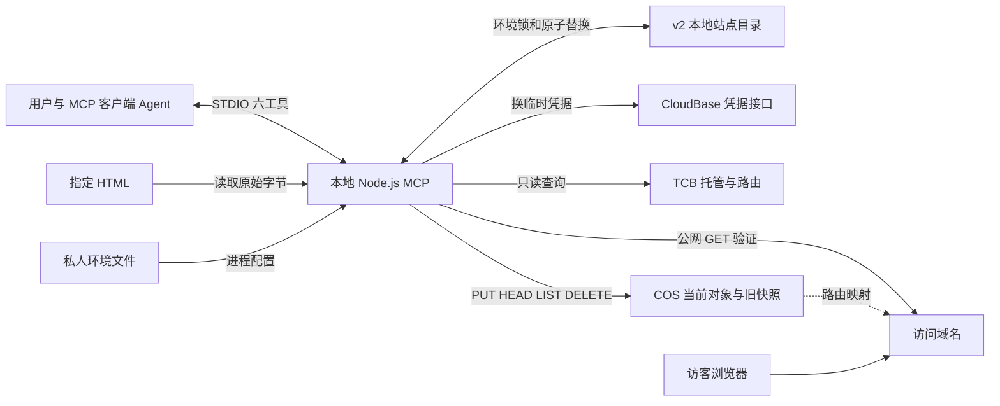
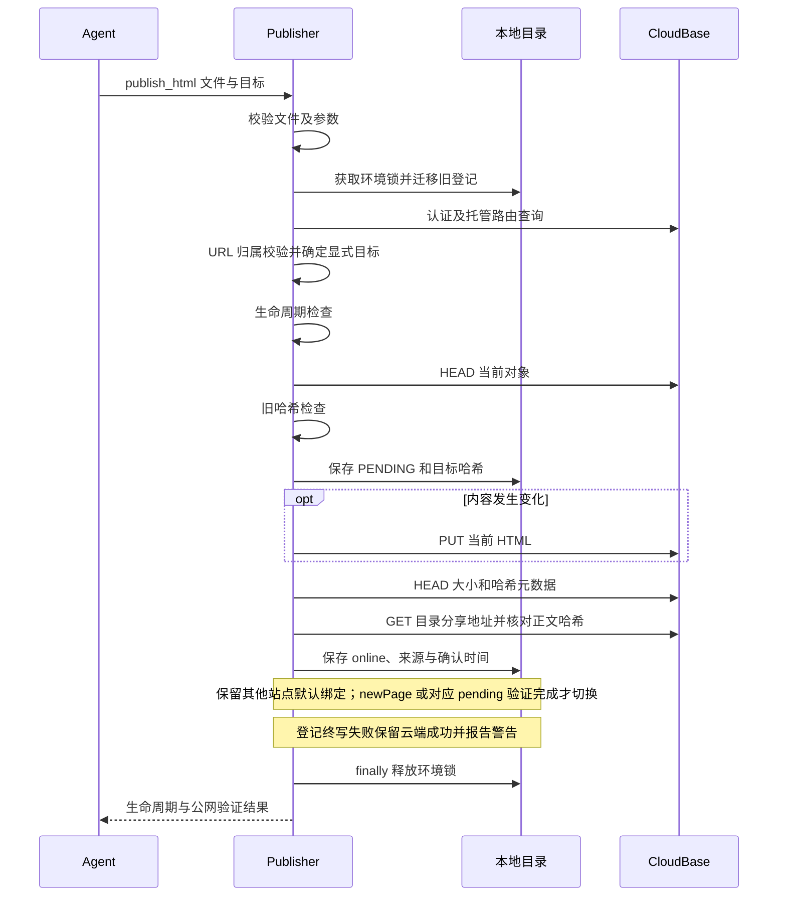
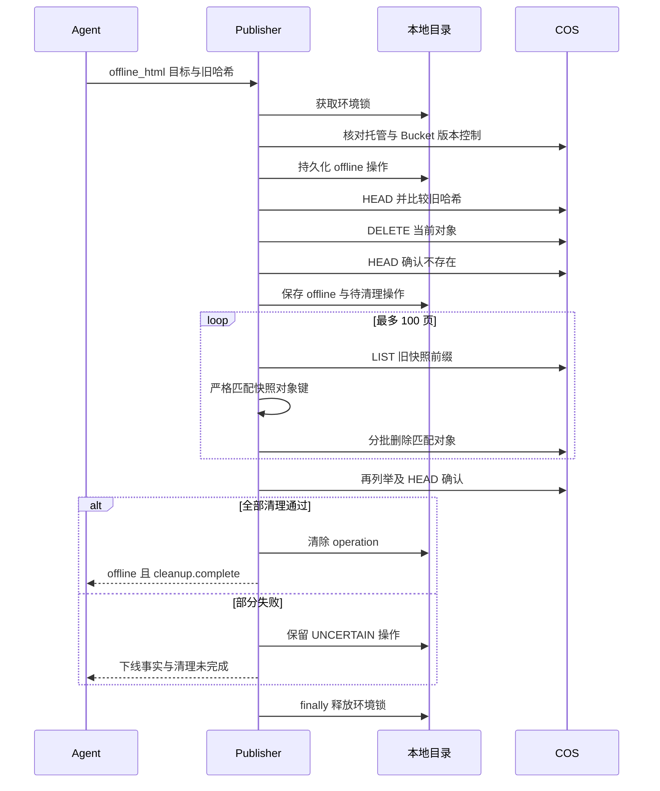
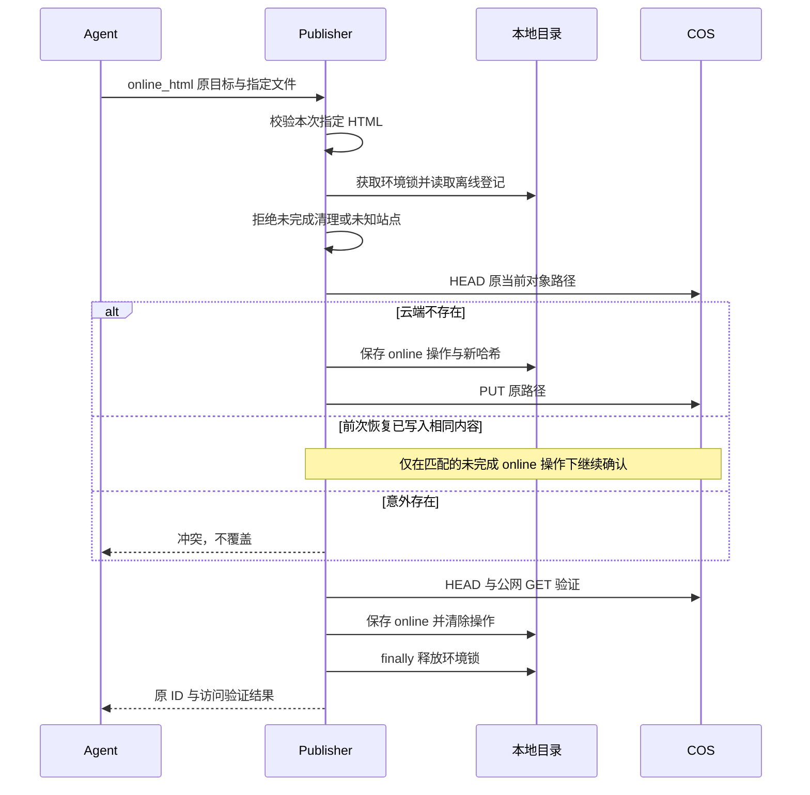

# 架构说明与关键时序

本文描述当前源码的结构：组件职责、工具契约、数据模型与关键时序。人可从图理解流程，Agent 可从职责和契约定位源码。接入步骤见 [快速开始](getting-started.md)，发布与验证证据见 [CHANGELOG](../CHANGELOG.md)，中文首页见 [README](../README.md)，另有 [英文简要介绍](../README.en.md)。

## 1. 总览

本地产物是内容来源，MCP 只读用户指定的 HTML；COS 保存当前对象。本地目录保存站点元数据，不保存 HTML。浏览器直接访问 CloudBase，不经过 MCP。

六工具不缩小环境 API Key 的实际权限；不会自动切换环境、创建资源、更改域名或 Bucket 设置。HTML 是数据，不执行其中的指令。STDIO stdout 只承载协议。

## 2. 组件和入口

| 模块 | 职责 |
| --- | --- |
| [CLI](../bin/cli.mjs) / [launch.mjs](../src/launch.mjs) | Node 版本检查、serve/setup 分流；读取一次配置，默认文件/显式文件/env 互斥；错误仍可发现工具。 |
| [server.mjs](../src/server.mjs) | 六工具 schema、逐参数说明、协议返回和错误恢复；真实路径入口判断支持符号链接。 |
| [setup.mjs](../scripts/setup.mjs) / [向导逻辑](../src/setup.mjs) | 独立交互式 CLI，环境/地域预填、隐藏输入 API Key、只读检查、生成客户端配置；不占用 MCP STDIO，不自动修改客户端。 |
| [config-file.mjs](../src/config-file.mjs) / [start.mjs](../scripts/start.mjs) | 仓库外私密文件读取与原子保存；新默认入口可受控收紧权限，旧 start 显式文件入口继续严格失败退出。 |
| [publisher.mjs](../src/publisher.mjs) | 文件验证、目标解析协调、当前对象发布、下线、恢复、列表与公网验证。 |
| [site-metadata.mjs](../src/site-metadata.mjs) | 名称校验、稳定 label 及 NFKC 关键词匹配；不访问云端或读取 HTML。 |
| [html-resources.mjs](../src/html-resources.mjs) | 事件式解析 HTML 资源与标题；CSS/srcset 有界扫描、目录内元数据检查、脱敏与截断；不作为安全检查。 |
| [registry.mjs](../src/registry.mjs) | v2 站点目录、v1 兼容迁移、环境级锁、路径绑定和未完成操作。 |
| [domains.mjs](../src/domains.mjs) | 网关发现、候选筛选、规范 URL 解析与当前环境归属校验。 |
| [cloudbase.mjs](../src/cloudbase.mjs) | 配置、临时凭据、官方 TCB/COS SDK 适配、版本控制闸门、分页与逐对象删除结果检查。 |
| [cleanup.mjs](../src/cleanup.mjs) | 严格旧快照路径过滤、清理、只读清单和按清单执行；无自动全桶清理。 |
| [recovery.mjs](../src/recovery.mjs) / [errors.mjs](../src/errors.mjs) | 结构化错误与下一步建议；建议不等于自动重试引擎。 |
| [call.mjs](../scripts/call.mjs) / [cleanup-snapshots.mjs](../scripts/cleanup-snapshots.mjs) | 一次性协议客户端、默认只读的旧快照清理 CLI。 |

配置契约：新 CLI 在启动时读取配置快照，Publisher 按首次工具调用创建。默认读取用户主目录 `.config/cloudbase-html-mcp/credentials.env`；`--config` 指定文件，`--env` 使用环境变量，三路互斥、不合并、不回退。文件错误保留为 CONFIG 诊断（含来源与路径），仍可初始化与列举六工具，不访问云端；修改文件后需重载。macOS/Linux 仅对标准默认位置中当前用户拥有的无重定向目录与普通文件自动收紧权限（Git 检查先于 chmod，经打开句柄核验身份）；显式路径保持严格检查；Windows 沿用账户 ACL。旧 `src/server.mjs` 环境变量入口、`start.mjs` 显式文件入口与 Node 原生 `--env-file` 均保留原行为；接入与向导的操作步骤见 [快速开始](getting-started.md)。

## 3. 工具契约

| 工具 | 输入 | 副作用与结果 |
| --- | --- | --- |
| hosting_status | 无 | 只读托管/路由；管理目录版本与是否启用；上传/删除权限不冒充已测。 |
| publish_html | localPath；可选 siteId 或 siteUrl、expectedSha256、newPage、displayName | 新建或更新在线对象；返回哈希、URL、写入/登记/公网验证结果，不返回新的 versionKey。 |
| get_html | siteId、siteUrl、localPath 三选一 | 查询真实云端；不回写本地目录；返回 observedStorage、生命周期与登记中的未完成操作。 |
| list_html | query、lifecycle、offset、limit | 只读当前环境本地目录；默认 50，最大 100；结果有总数和 nextOffset。 |
| offline_html | 一个选择器及 expectedSha256 | 删除当前对象及严格匹配的旧快照；保留登记，分开返回生命周期和清理完成度。 |
| online_html | siteId 或 siteUrl，另带 localPath；可选 displayName | 已登记离线站点恢复；不从旧快照读取内容。 |

### 输入约束

- localPath 为绝对 `.html`/`.htm` 文件、非空有效 UTF-8、最多 20 MiB；只上传原始字节，关联资源不上传。
- 更新已存在目标必须带 `get_html` 返回的实际旧哈希（`expectedSha256`），冲突后重新查询再判断；首次新建省略。
- `newPage: true` 不与 siteId/siteUrl 同传；`online_html` 缺少 siteId/siteUrl 时在取登记锁或连云之前返回 `ONE_PAGE_SELECTOR_REQUIRED`。

### 目标解析与路径绑定

显式 siteId/siteUrl 决定更新或恢复目标，localPath 仅提供内容：路径默认绑定另一站点时，保留该绑定及其 pending、站点记录和云端内容，只更新目标并记录 sourcePaths；无绑定的来源路径可登记到目标站点。`newPage`（或重试其对应 pending）验证成功才切换默认绑定；下线不释放绑定。写操作结果含 `pathBinding`：`localPath`（规范化来源路径）、`defaultSiteId`、`pendingSiteId`、`matchesTarget`；登记终写失败时这些字段反映已持久化的绑定，不冒充切换成功。离线站点不经 publish_html 隐式公开。

### URL 规则与分享地址

URL 只接受 HTTPS `/sites/s-<32位小写十六进制>/` 或其 `index.html`，可带片段；不允许查询参数、凭据、转义路径、路径穿越。先检查原始拼写再解析，随后分别核实输入路径与规范 `index.html` 路径均映射到当前环境托管资源（目录与文件可能命中不同路由，不能互相替代）；无法确认时拒绝，不抓取任意 URL 或跟随重定向。分享地址与存储对象分开：对 `sites/<siteId>/index.html` 生成 `/sites/<siteId>/` 候选并直接公网校验目录响应，不借用文件路由；旧完整文件 URL 仍可定位同一对象，旧登记链接仅在列表/离线查询返回视图中规范为目录地址。

### 结果字段与诊断

- 公网验证始终以结果返回失败，不抛异常；已识别失败分为 `TIMEOUT`、`ABORTED`、`DNS_ERROR`、`TLS_ERROR`、`RESPONSE_TOO_LARGE`，其余保留 `PUBLIC_FETCH_FAILED`。
- 未预期异常返回 `INTERNAL_ERROR` 与 `diagnostic`（`errorId` 关联协议结果与 stderr，`errorType`/可选 `errorCode` 仅来自固定白名单）；stderr 不输出原始消息、堆栈、路径或参数。
- 发布/恢复返回 `resourceDiagnostics`（静态引用计数、去重资源、目录内元数据检查，脱敏与截断；单路径最多 64 层、每次最多 4,000 次元数据调用）与 `displayName`/`htmlTitle`/`label`/`metadataPersisted`；诊断不阻止发布。字段说明见 [快速开始](getting-started.md#resource-diagnostics)。
- `get_html` 对已知 ID 或已核实 URL 的元数据读取失败时返回 `registryDiagnostic`，不阻断云端查询、不回写目录；元数据不可用且云端对象不存在时仍返回 SITE_NOT_FOUND。按路径解析、列表及所有写操作保持严格目录依赖。

## 4. 本地与云端数据

- 当前对象：`sites/<siteId>/index.html`，更新覆盖同一路径；域名映射不变则 URL 不变。自 v0.3 起不创建云端快照；旧版 `deployments/<siteId>/<sha256>/index.html` 只供指定范围清理。
- 默认登记目录：用户主目录 `.config/cloudbase-html-mcp/pages/`；可配置仓库外绝对目录或 `off`。每环境/地域一份 `<哈希>.catalog-v2.json`，内含 version、scope、sites、bindings。
- sites 按 siteId 保存 sha256、url、localPaths、sourcePaths、lifecycle、verifiedAt、updatedAt、state、operation，及可选 displayName/htmlTitle。localPaths 由当前 bindings 生成，仅含可操作选择器；sourcePaths 是历史来源。bindings 保存路径的当前 siteId 与可选 pendingSiteId。
- 文件 0600、新目录 0700；环境排他锁（wx）+ 临时文件 fsync 后 rename，站点记录与绑定一同提交。目录准备失败返回 `REGISTRY_WRITE_FAILED`，仅锁文件已存在返回 `REGISTRY_BUSY`。同机同目录同环境互斥；跨机器/目录不互斥，也不构成云端原子 CAS。
- v1 哈希路径文件兼容只读，首次写锁内迁入 v2；原绑定与 pending 保留，冲突哈希置 null 并记 conflictingHashes 待云端核对；迁移后不要运行 v0.2 写入者。旧 v2 的 localPaths 混入历史路径时，读取视图按 bindings 重建并保留 sourcePaths，持锁写入时落盘。
- lifecycle 仅 online/offline（null 为未确认）；state 为 PENDING/UNCERTAIN/STORAGE_VERIFIED，operation 记录目标哈希与进度，均不替代生命周期。列表是最近保存状态，查询返回云端实际观察值。
- 名称与标题：候选元数据保存在 operation.metadata，STORAGE_VERIFIED 保存才提升；相同哈希重试省略名称时复用候选，不同内容不继承；offline 只保留已确认字段。搜索在内存视图执行：query ≤200 字符，NFKC/小写、空白分词，词间 AND、字段间 OR，仅匹配名称/标题/来源 basename；先过滤后按 updatedAt 降序分页，不另建索引、不写目录。label 按“自定义名 → 标题 → 当前文件名 → 来源文件名 → ID”兜底；名称不参与写操作定位。

## 5. 发布与更新时序

要点：PUT 前先留 PENDING 恢复记录，写入超时不等于未写入；HEAD 核对大小与哈希元数据，公网 GET 才对正文计算哈希；公网验证失败不重复上传、不覆盖存储成功事实。首次新建失败保留预留 ID；替换路径的新建失败保持原绑定和 pending；查询 pending 证实云端存在后，可带其 ID 与当前哈希发布以验证并提升绑定。显式更新/恢复另一站点不预留或覆盖该路径的 pendingSiteId，绑定策略在目录保存层执行。

## 6. 下线与清理时序

要点：版本控制 Enabled/Suspended/无法核实在任何删除前停止；预检查哈希冲突时恢复操作前登记；DELETE 发出后结果不确定则保留原哈希待核对重试。分页游标必须前进（超过 100 页返回可恢复错误），每批最多 1,000 个对象且逐对象核对结果（HTTP 成功也检查错误/遗漏）；清理后复查当前对象，检测外部写入者重建。删除不清除外部缓存，不更改 Bucket 设置；独立清理 CLI 默认只读，apply 按清单校验环境/Bucket/路径/ETag 后执行，共用环境锁。

## 7. 原 ID 恢复时序

要点：恢复不从云端历史读内容，必须提供本地文件；成功后再调用 online_html 不覆盖，正常更新走 publish_html；云端成功但登记终写失败，可用同一 ID 与同一文件核验收口。错误恢复按前置原因分流（文件/参数、登记、配置、凭据、托管各自返回修复建议，不被通用生命周期提示覆盖；缺少离线登记提示核对原环境/目录/原机器，不建议新建替代）。进程直接退出不执行 finally：恢复记录保留，遗留环境锁须确认无写入者后人工移除。

## 8. 认证、域名与验证

临时凭据仅内存缓存，提前 5 分钟刷新并合并并发交换；请求超时与响应大小有上限；COS 官方 SDK 负责签名。每次连接查询当前托管资源与路由。域名发现最多 3 页、每页 1,000，不完整结果丢弃；按最长路径匹配当前 Bucket/staticstore，排除禁用、认证、错误上游、未就绪、非空重写及不明确非根透传。普通发布/ID 查询优先显式配置，否则自定义域名优先，最多 3 个公网候选并保留平台回退。URL 目标验证必须完整确认归属，不使用发现失败时的乐观回退。公网结果 PUBLISHED / PUBLISHED_PREVIEW / UPLOADED_NOT_PUBLICLY_VERIFIED 与生命周期分开；默认域名 attachment 提示预览限制，不等于实测浏览器提示页；hosting_status 不验证上传、删除或页面公网内容。

测试离线运行：真实 STDIO 子进程 + 官方 SDK + 云替身 + 真实临时文件；`npm run test:prepare` 准备独立 npm 缓存（允许联网），`npm test` 离线完成，含实际 tarball 安装与重装。测试文件按模块对应（publisher/domains/registry/lifecycle/recovery/config-paths/setup/stdio/launch/package/html-resources/site-metadata/release），覆盖上述契约与失败恢复路径；v0.3 真实云端验收记录见 [CHANGELOG](../CHANGELOG.md)。

修改行为需补回归并运行 `npm run check` 与 `npm test`；同步中文 README、快速开始及本文；规划放在 [PROJECT.md](../PROJECT.md)，不能画成已实现组件。

## 9. 分发边界

包元数据为版本唯一来源；`bin` 提供稳定入口，白名单限制发布内容，`npm-shrinkwrap.json` 锁定传递依赖；凭据与登记目录在用户主目录，不随安装位置移动。发布流程、CI 与公共包验证见 [发布维护指南](releasing.md) 与 [CHANGELOG](../CHANGELOG.md)。
