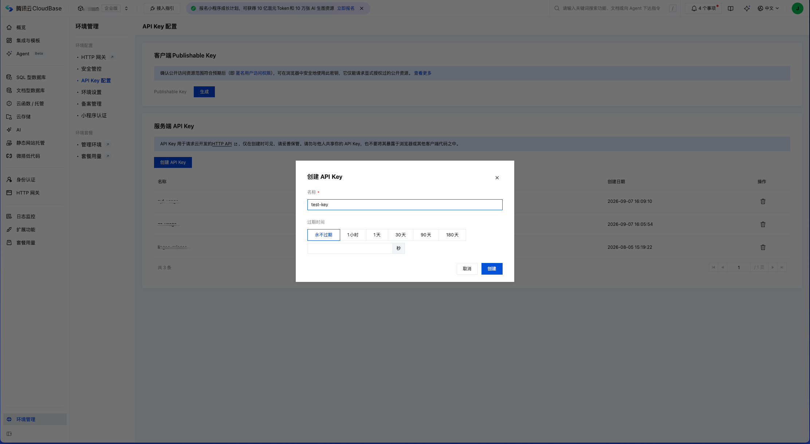

# 快速开始

<a id="1-what-you-will-have"></a>
<a id="1-the-main-workflow"></a>
## 1. 接入流程

**准备 Node.js → 放好完整配置文件 → 在 Agent 中添加本地 MCP → 验证 → 开始使用。**

<!-- release:version -->
当前预发布版本为 **0.5.0-beta.1**。请使用文中的固定版本命令，也可采用 [源码或本地安装包](#install-from-source-or-a-local-package)。macOS 和 Windows 均要求 Node.js 22+，安装包不内置 Node。发布、CI、公共 npm 冷启动及桌面实测分别记录，见 [验证状态](../PROJECT.md#v05-release)。
<!-- /release:version -->

**此版本已发布到 npm 的 beta 标签**，可使用本页固定版本命令；同机共享登记目录的客户端应统一升级。

你需要能够启动本地 STDIO MCP 的 Agent 客户端，以及已开启静态托管的 CloudBase 环境。CLI、IDE 和桌面客户端按各自的配置格式接入。先选择自己的准备路线：

| 你的情况 | 下一步 |
| --- | --- |
| 使用自己的 CloudBase 环境 | [准备环境](#new-to-cloudbase)、[获取 API Key](#get-cloudbase-api-key)，然后填写配置模板。 |
| 已收到管理员的完整配置文件 | 直接 [放置文件](#for-the-recipient)，无需登录 CloudBase 或重填参数。 |
| 为其他人准备接入 | 按 [配置准备与交付](#for-the-administrator) 填好文件，再交付无 Key 的客户端配置。 |

人和 Agent 共用本指南；接入检查本身不授权发布 HTML 或修改云资源。

<a id="prepare-node"></a>
### 准备 Node.js（首次使用）

已有可用的 Node.js 22+ 和 npm/npx 时直接复用，无需重装。还没有安装时：

1. 打开 [Node.js 官方中文下载页](https://nodejs.org/zh-cn/download)，新安装可选择 **Node.js 24 LTS**。选择自己的操作系统及对应架构，下载安装程序；不需要 Docker 或源码包。
2. **macOS：** 在“关于本机”查看芯片类型（Apple 芯片或 Intel），选择对应选项，下载并双击 `.pkg` 安装程序。 **Windows：** 在“设置→系统→关于→系统类型”查看 x64 或 ARM64，下载对应的 `.msi` 安装程序。按默认选项完成安装；如果提供 npm、加入 PATH 等选项，请保持启用，以便后续使用 npm/npx 命令。参见 [npm 安装说明](https://docs.npmjs.com/downloading-and-installing-node-js-and-npm/)。
3. 安装后重新打开终端：macOS 使用“终端”；Windows 可按 `Win+R` 输入 `cmd` 打开命令提示符。也可以让已有终端执行能力的 Agent 帮你检查：

```sh
node --version
npm --version
npx --version
```

三条命令均应输出版本号，Node 主版本应为 22 或更高。找不到命令时先关闭旧终端并重新打开；仍失败则检查安装是否完成及 PATH，不继续添加 MCP。检查通过后重新打开终端会话；图形客户端完全退出再打开，使其获得新的 PATH，然后准备或放置配置文件。

<a id="execution-location"></a>
### 先确认 MCP 在哪里运行

默认路径中的“用户主目录”属于运行 MCP 进程的账户，`localPath` 也必须是该进程能读取的路径。先确认运行位置，再放文件：

| 运行位置 | 文件与路径 |
| --- | --- |
| 本机 CLI、IDE 或桌面客户端 | 使用当前用户主目录；HTML 使用本机的实际绝对路径。 |
| 远程机器、容器或 WSL 中的 Agent | 凭据、Node 和 HTML 必须在对应执行环境中可用；不能直接照搬电脑上的路径。仅在用户指定后传入或挂载文件，不自动搬运凭据。 |

MCP 仍通过 STDIO 启动，不提供可填入远程 HTTP/SSE 栏的服务地址。当前项目的正式平台范围是 macOS/Windows；Linux、容器、WSL 及各 Agent 的远程执行组合未获本项目实机验收，配置说明不代表这些组合已验证。

<a id="2-before-you-begin"></a>
<a id="2-receive-or-prepare-the-configuration-file"></a>
## 2. 领取或准备配置文件

<a id="43-alternative-prepare-the-private-environment-file-manually"></a>
<a id="for-the-administrator"></a>
### 自行配置或为他人准备

复制 [credentials.env.example](../templates/credentials.env.example)，填好三个必填值，以 **credentials.env** 文件名保存。自己使用时直接放到 [固定位置](#for-the-recipient)；为他人准备时整份私下交付。使用环境的管理端 API Key，不使用 Publishable Key、Key ID 或 CAM SecretId/SecretKey。

```dotenv
CLOUDBASE_ENV_ID=your-env-id
CLOUDBASE_REGION=your-region
CLOUDBASE_API_KEY=your-full-environment-api-key
```

将示例值替换为实际环境信息。文件不包含收件人的用户名或安装路径。可选项 `CLOUDBASE_PUBLIC_BASE_URL`、`CLOUDBASE_REGISTRY_DIR` 见模板和 [.env.example](../.env.example)，普通接入可以留空。登记目录默认位于收件人的用户主目录；设置为 `off` 会关闭列表、下线和恢复功能。

将填好的文件与对应 [客户端 JSON](clients.md#json-import--json-导入) 一起交付。两份材料职责不同：

| 文件/配置 | 谁准备、放在哪里 | 是否含 Key |
| --- | --- | --- |
| `credentials.env` | 管理员填好，收件人放到下述固定用户目录。 | 是，私下交付。 |
| MCP JSON | 使用本项目模板，按 Agent 支持的格式添加，或粘到 JSON 导入/配置编辑器。 | 否，只说明启动哪个程序。 |

尚未取得 Key 时按 [控制台获取步骤](#get-cloudbase-api-key) 操作；已拿到完整文件的收件人直接继续放置。本指南不会自动创建或发送凭据。

<a id="for-the-recipient"></a>
### 配置文件如何放置

保留 UTF-8 纯文本格式，支持 Windows 常见的 CRLF 换行和 UTF-8 BOM。

将收到的文件放在自己用户主目录下：

```text
.config/cloudbase-html-mcp/credentials.env
```

- **macOS：** 访达 → 前往 → 前往文件夹（`⌘⇧G`），输入 `~/.config/cloudbase-html-mcp`。目录已存在时，直接放入文件；目录不存在时，使用下面的“创建并打开目录”步骤，不要求在访达手动新建点开头的目录。按 `⌘⇧.` 可显示隐藏文件。
- **Windows：** 在资源管理器地址栏粘贴 `%USERPROFILE%`，依次创建 `.config` 和 `cloudbase-html-mcp` 文件夹，再放入文件。开启“文件扩展名”显示，确认没有变成 `credentials.env.txt`。

**Mac 目录尚不存在时：** 可直接对已有终端能力的 Agent 说：

> 请帮我创建并在访达打开当前用户的 ~/.config/cloudbase-html-mcp 目录。我会放入管理员给的 credentials.env。保留已有目录和文件，不读取或覆盖凭据，不发布页面。

Agent 或用户可在 macOS 终端执行下列一次性命令；它只创建缺少的目录并打开文件夹，不创建或覆盖凭据文件，也不更改已有目录权限：

```sh
(
  umask 077
  mkdir -p "$HOME/.config/cloudbase-html-mcp" &&
    open "$HOME/.config/cloudbase-html-mcp"
)
```

看到打开的文件夹后，再放入收到的文件。若命令报告权限错误或访达未打开，先检查终端提示，不把失败当作目录已就绪。

已有文件时，先核对目标环境再决定是否复用，不覆盖其他接入配置。程序自行定位用户主目录；默认情况下，客户端无需填写用户名、配置路径或 `cwd`。该文件与 npm 安装目录、缓存及源码目录分开保存。

在 macOS/Linux 上，新入口可以把标准默认位置中属于当前用户的专用目录和普通文件权限收紧为目录 0700、文件 0600，不修改内容；拒绝 Git 目录、凭据文件链接及被重定向的默认目录。显式自定义路径保持严格检查，不自动改权限。Windows 使用当前账户已有 ACL，不提权、不重写 ACL，也不以 POSIX 模式位判断 Windows 权限。

<a id="new-to-cloudbase"></a>
### 从零准备 CloudBase

**已收到完整配置文件？** 直接按上节放置并继续添加 MCP。 **只收到 Key？** 向管理员取得对应环境 ID 和地域后填写模板，也可以使用 [可选向导](#optional-setup-wizard)，无需控制台登录。

已有环境和私密配置时直接复用。需要从零准备的环境所有者按下表操作；控制台名称可能调整，以官方指南为准。

| 步骤 | 操作 | 完成标志 |
| --- | --- | --- |
| 1. 登录 | 打开 [CloudBase 控制台](https://tcb.cloud.tencent.com/dev)，注册或登录腾讯云账户并完成要求的身份验证。 | 可以使用环境所属账户进入控制台。 |
| 2. 准备环境 | 参考 [创建环境](https://docs.cloudbase.net/quick-start/create-env)。优先复用合适环境；新建前核对服务条款、服务角色授权、地域和套餐。 | 初始化完成，已选中目标环境。 |
| 3. 记录环境信息 | 在环境信息或设置中复制环境 ID（EnvId）和地域代码。使用 ID 而非显示名称，地域不能直接照搬示例。 | 两个值属于同一目标环境。 |
| 4. 检查静态托管 | 打开该环境的“静态网站托管”，按需要核对并完成开通；已有 HTML 使用“文件管理”流程，见 [托管指南](https://docs.cloudbase.net/hosting/quick-start)。 | 静态托管文件管理可用，稍后由 MCP 检查在线状态。 |
| 5. 获取 Key | 在同一环境的“环境管理 → API Key 配置”中创建服务端 Key，详见下方步骤。 | 拿到完整 Key，而非名称、ID 或列表中的脱敏值。 |

环境所有者在控制台完成登录、身份验证、服务授权、资源开通、套餐支付确认及 Key 创建。Agent 可解释步骤并继续本地检查，但不能仅因“接入”请求就代下单、开通资源或创建凭据。云服务费用、试用和配额以当前账户及套餐为准，工具采用 MIT 不代表云服务免费。

<a id="get-cloudbase-api-key"></a>
### 在控制台获取服务端 API Key

以下步骤面向环境管理员。界面名称按 2026-09-09 的控制台截图核对；后续版本如有调整，在当前环境中查找“API Key 配置”。只领取配置文件的使用者无需完成这些步骤。尚未准备环境或静态托管时，先完成 [从零准备 CloudBase](#new-to-cloudbase)。

1. 打开 [CloudBase 控制台](https://tcb.cloud.tencent.com/dev)，在顶部选择要发布网页的环境。记录该环境的 **环境 ID** 和 **地域代码**，稍后分别填入 `CLOUDBASE_ENV_ID`、`CLOUDBASE_REGION`。地域使用 `ap-shanghai` 这样的代码，按实际环境填写，不照搬示例。
2. 点击左下角 **环境管理**，在中间菜单选择 **API Key 配置**。
3. 页面上方是 **客户端 Publishable Key**；本工具使用下方的 **服务端 API Key** 区域，点击其中的 **创建 API Key**。
4. 在弹窗中填写便于识别的名称，例如 `html-sharing`，按使用安排选择 **过期时间**，然后点击 **创建**。名称只是标识，不是要填进配置的凭据。
5. 在创建结果中复制**完整 Key 值**，立即保存到 `credentials.env` 的 `CLOUDBASE_API_KEY=` 后面。保留整段字符串，不加 `Bearer `，不填 Key ID、名称或列表里的脱敏值。完整 Key 仅在创建时返回，参见 [官方 API Key 说明](https://docs.cloudbase.net/api-reference/manager/node/login-config#createapikey)。
6. 核对三个值属于同一环境，保存为 UTF-8 纯文本的 `credentials.env`。管理员可整份私下交付；收件人按 [固定位置](#for-the-recipient) 放好，再添加 MCP。



图：2026-09-09 的控制台界面，展示“环境管理 → API Key 配置 → 服务端 API Key → 创建 API Key”。弹窗中的 `test-key` 是名称，不是 Key 值；过期时间按实际需要选择。[查看原图](images/cloudbase-api-key-console.png)。

```dotenv
CLOUDBASE_ENV_ID=your-env-id
CLOUDBASE_REGION=your-region
CLOUDBASE_API_KEY=your-full-environment-api-key
```

上面全部为占位值。若创建后只剩脱敏列表、完整值已丢失，需要管理员重新创建并更新配置；已有有效的完整 Key 可以继续复用，不删除其他服务正在使用的 Key。Key 到期或更换后，更新收件人的文件并重载 MCP，再用 `hosting_status` 检查。

多人可配置同一个 CloudBase 环境，分别发布页面；各机器的本地登记、名称和搜索不会自动同步，管理员也不会自动获得全员站点清单。本工具不提供成员级站点隔离或团队管理后台。整份文件交付是接入便利，不是本项目独有的授权机制；CloudBase [官方 MCP](https://docs.cloudbase.net/solutions/cloudbase-platform-edition/bind-agent-to-cloudbase) 也支持 API Key 下发接入。

此 Key 是管理端环境凭据，权限范围大于本工具的六项能力；保持在私密配置文件中，不放入发布的 HTML、公开 MCP JSON 或 Git 仓库。它与 Publishable Key、CAM SecretId/SecretKey、CloudBase CLI 登录态不同。[官方 MCP 认证说明](https://docs.cloudbase.net/ai/cloudbase-ai-toolkit/connection-modes) 介绍了环境 Key 换取临时凭据的机制；本项目使用上面的 `credentials.env` 格式，不照搬官方 MCP 的启动配置。

**连通检查不要求自定义域名。** 初次接入可不设置 `CLOUDBASE_PUBLIC_BASE_URL`。默认域名限制见 [首次使用](#6-first-use)，绑定自定义域名是单独的配置决定，不需要为了完成接入上传控制台样例。

<a id="3-let-your-agent-set-it-up"></a>
<a id="44-register-the-server-in-your-client"></a>
<a id="3-add-the-mcp-to-your-client"></a>
## 3. 在 Agent 中添加本地 MCP

按 [Agent 接入指南](clients.md#choose-integration) 选择当前客户端的 CLI 命令、JSON、YAML 或表单。可 [让 Agent 帮忙接入](#agent-assisted-setup)，也可 [手工配置](#manual-mcp-setup)；两条路线使用相同的凭据文件与固定包版本。保留已有 MCP 条目，选择 **STDIO**，服务名称填 `cloudbase_html`；采用配置文件时，环境变量栏留空。

<a id="manual-mcp-setup"></a>
### 手工配置：支持 mcpServers 的客户端可直接复制 JSON

选择“通过 JSON 导入”或“配置 MCP”的 JSON 编辑器，按运行 MCP 的电脑系统复制下列内容。已有配置时只合并 `mcpServers.cloudbase_html` 条目。`credentials.env` 事先放好后，JSON 中不需要 `env`、Key 或用户名路径。

**macOS** · [同内容文件](../templates/mcp.macos.json)

```json
{
  "mcpServers": {
    "cloudbase_html": {
      "command": "npx",
      "args": ["-y", "cloudbase-html-mcp@0.5.0-beta.1", "serve"]
    }
  }
}
```

**Windows** · [同内容文件](../templates/mcp.windows.json)

```json
{
  "mcpServers": {
    "cloudbase_html": {
      "command": "cmd.exe",
      "args": ["/d", "/c", "npx", "-y", "cloudbase-html-mcp@0.5.0-beta.1", "serve"]
    }
  }
}
```

WorkBuddy 和千问办公的 JSON 接入已有 beta.2 实测依据，QoderWork 官方说明提供 JSON 导入入口；豆包工作按已确认的 STDIO 表单分别填 `command` 与 `args`。具体入口、可选字段和格式差异见 [客户端指南](clients.md#json-import--json-导入)。不要把整段 JSON 当作终端命令。

<a id="agent-assisted-setup"></a>
### 让 Agent 帮忙接入

可以复制：

> 阅读 https://github.com/zyfasos/cloudbase-html-mcp/blob/main/docs/getting-started.md ，帮我接入 cloudbase_html MCP。先确认本次 MCP 在哪台机器、哪个账户运行。复用已有 Node 和我已经准备或领取的 credentials.env，不回显 Key；若缺少文件，引导我准备，不猜测环境或创建云资源。按本指南放到固定位置。读取当前客户端的官方接入说明，使用对应系统和客户端的固定版本配置，保留其他连接器，完成 hosting_status 与 list_html 只读验证，不发布页面。如果指定 npm 版本未发布，明确说明并使用我提供的本地安装包或源码，不另装其他包。

已有本地检出时，可将上述链接替换为本仓库的 `docs/getting-started.md`。

<a id="4-install-and-configure"></a>
<a id="4-advanced-and-alternative-setup"></a>
## 4. 其他配置与安装方式

<a id="configuration-sources"></a>
### 配置来源

| 命令 | 使用的配置 |
| --- | --- |
| `cloudbase-html-mcp serve`，或不传子命令 | 用户主目录下的默认 credentials.env |
| `cloudbase-html-mcp serve --config "/absolute/private/credentials.env"` | 仅使用指定私密文件 |
| `cloudbase-html-mcp serve --env` | 仅使用五个受支持的 CloudBase 环境变量 |

Windows 的配置文件绝对路径不能包含 `..` 路径段；使用默认位置或不含父目录跳转的完整路径。POSIX 配置路径先按文件系统解析目录符号链接，再处理父目录语义，检查与读写使用同一物理目标；缺失目录后的 `..` 无法明确定位时拒绝，不改指相邻文件。

`--config` 与 `--env` 互斥。文件缺失或无效时不回退到继承的环境变量，不混合不同来源的字段。新入口要求每行一个赋值，支持注释及引号值，拒绝语法错误或重复字段。配置在进程启动时读取；修改或替换后重载 MCP。`--help`、`--version` 不需要凭据，也不连接云端。

<a id="42-run-the-local-setup-wizard-recommended"></a>
<a id="optional-setup-wizard"></a>
### 可选向导

自行准备配置的用户，可在本机交互式终端运行：

```sh
npx -y cloudbase-html-mcp@0.5.0-beta.1 setup
```

向导收集环境、地域及隐藏输入的 Key，只读检查通过后才保存。已有配置默认复用，输入 `edit` 修改；Key 留空则保留原值。取消或失败保留原文件，不自动修改桌面客户端配置。

可选参数为 `--env-id ID`、`--region REGION`、`--config ABSOLUTE_PATH`，或 `--connection ABSOLUTE_JSON_PATH`。其中连接 JSON 仅含 `envId` 和 `region`，不含 Key，与完整的 credentials.env 不同。Key 不通过命令参数或管道输入。

生成的 JSON/TOML 使用固定包版本，不引用 npx 缓存。Windows 标准文件位置使用默认模式；自定义路径含 cmd.exe 解释字符时，在检查或保存前拒绝。参数数组支持普通空格和中文路径。

向导对自定义文件继续严格检查权限。macOS/Linux 使用当前用户拥有的专用目录（0700）和普通文件（0600）；Windows 使用账户 ACL。

<a id="41-install-and-check-locally"></a>
<a id="install-from-source-or-a-local-package"></a>
### 从源码或本地安装包接入

普通接入优先使用 npm 固定版本。无法使用 npm 时的两条替代路线：

- **本地 `.tgz` 安装包**（管理员或离线场景交付）：在命令提示符/终端执行，引号内替换为实际文件路径并保留双引号；此操作只安装程序命令，不写入云端凭据。

```sh
npm install --global --ignore-scripts "/absolute/path/cloudbase-html-mcp-0.5.0-beta.1.tgz"
cloudbase-html-mcp --version
```

- **直连源码入口**：客户端 `command` 使用 `node -p "process.execPath"` 取得的 Node 绝对路径，参数示例（替换为实际位置）：`["/absolute/path/to/cloudbase-html-mcp/bin/cli.mjs", "serve"]`。

全局安装后，macOS 使用命令 `cloudbase-html-mcp` 和参数 `serve`；Windows 使用 `cmd.exe` 及参数 `/d`、`/c`、`cloudbase-html-mcp`、`serve`。核对客户端 PATH，必要时使用实际 Node 与 CLI 文件绝对路径，不引用临时解压目录。

源码开发环境（npm ci/check/test）、旧入口兼容说明、从 v0.2 升级与旧快照清理见 [源码开发、升级与旧快照清理](maintenance.md)。

<a id="5-verify-the-connection"></a>
## 5. 验证连接

在实际 Agent 客户端保存并重载 MCP，确认恰好提供 `hosting_status`、`publish_html`、`get_html`、`list_html`、`offline_html`、`online_html` 六工具。

调用 `hosting_status`，应返回 `ok: true`、预期环境和地域，以及新 CLI 使用的 `configuration.source` / `configuration.path`，不包含 Key。再调用 `list_html` 验证本地登记可读；新用户空列表正常。`hosting_status` 本身不读取目录，要使用完整管理能力，`management.enabled` 应为 true。

新入口遇到配置缺失、不可读或无效时仍可初始化和发现工具；调用会返回配置位置及修复建议，不访问云端。放好文件后重载。`--env` 模式的错误指向客户端变量，不虚构文件路径。

实际 Agent 客户端检查通过才算接入完成。独立 SDK 子进程通过不代表当前客户端配置已加载；接入检查不验证上传、删除权限或公网 HTML，首次发布需要用户另行指定文件并发起操作。

<a id="6-first-use"></a>
## 6. 首次使用

<a id="publish-a-page"></a>
### 发布页面

将示例路径替换为自己的文件，对 Agent 说：

> 将 `/absolute/path/report.html` 发布到我配置的 CloudBase 环境，并给我链接。

使用 `publish_html` 上传**用户指定的文件**，要求 UTF-8 HTML、最多 20 MiB；不上传关联的本地资源。不为完成接入擅自上传样例或业务文件。

成功结果包含 `siteId`、内容哈希、URL 和验证状态。需要从其他机器访问此页面时，保留站点 ID。

<a id="resource-diagnostics"></a>
### 关联资源诊断

发布和恢复返回 `resourceDiagnostics`，原 `warnings` 字符串继续保留。诊断只解释问题，不阻止有效 HTML 发布，不改文件、不上传或内嵌关联资源。

- `referenceCount`：发现的静态引用次数；`uniqueResourceCount`：已收集的去重资源数。`counts` 按相对、根路径、网络、内嵌、片段、非便携和未支持引用分类。
- `scanComplete`：受支持的静态语法是否完整扫描；`countsComplete`：去重收集是否完整；`truncated`：收集或明细输出是否截断。去重上限1,000、明细上限100，超限时不能把显示的数量当成全部资源数。
- `details`：资源类型、脱敏引用、来源位置、出现次数、`localCheck` 及处理建议。缺失和非便携引用优先显示；引用显示最多256字符，单项被裁剪时`referenceTruncated: true`，并同时设置总体truncated。内嵌data和片段仅计数，URL凭据、查询和片段不回显。
- `localCheck.state`：`EXISTS`、`MISSING`、`NOT_FILE`、`INACCESSIBLE` 或 `NOT_CHECKED`。只有 HTML 所在物理目录内的相对路径做元数据检查，存在不代表已经上传；越界、无法映射的base、根路径和非便携引用不猜测为缺失。
- `localChecksComplete`：收集的相对路径是否均得到确定检查结果；单路径最多64层、本次最多4,000次文件系统元数据操作，超限标为未检查。

例如同一图标引用32次，诊断会将引用次数与不同资源数量分开。遇到 `MISSING`，提供缺失资源或重新生成已内嵌资源的单 HTML；若在检查范围外，则请用户核对来源，不据此断言文件不存在。内嵌后仍需重新检查20 MiB大小限制。

只解析明确的静态资源属性、srcset及实际style内容中的CSS url/import；不执行JavaScript、不跟随外部CSS、不扫描普通导航链接、不请求网络资源。CSS转义等无法可靠解释时标记未完整分析。没有告警不等于页面完整自包含，成功发布也不等于资源完整。`get_html` 不重新扫描本地文件或关联资源。

<a id="site-names-and-search"></a>
### 为站点命名与检索

对 Agent 说：“发布这份报告，命名为给领导看的半年报告。”对应 `publish_html` 的可选 `displayName`。它去除首尾空白后为1–120个Unicode字符，不接受空白名或控制字符；`online_html` 也支持。省略保留原名，本版不支持清空或独立改名。

`htmlTitle` 从本次 HTML 的 head/title 提取，解码实体、合并空白，最多300字符；没有标题为空。自定义名称不会被标题覆盖。结果 `label` 按“自定义名称 → HTML标题 → 当前绑定文件名 → 历史来源文件名 → siteId”兜底；多个文件名按稳定排序选取。

```json
{
  "query": "经营报告 领导",
  "lifecycle": "online",
  "offset": 0,
  "limit": 20
}
```

以上为 `list_html` 参数：`query` 最多200个Unicode字符，忽略首尾空白，NFKC与大小写归一化后按空白分词；每个词须命中名称、标题或某个来源文件名，允许各词命中不同字段。先搜索和状态过滤，再排序分页；`total` 为过滤后总数。空白查询等同不搜索，不支持正则或语义搜索，也不搜索完整路径或HTML。

名称可以重复，只用于显示和搜索，不能作为写操作目标；目标不明确时让 Agent 展示候选并询问，不能直接选最新记录覆盖或删除。siteId/URL及共享文件默认绑定的规则不变。

名称和标题仅保存在当前环境的本地 v2 目录，不同步到云端或其他机器；`get_html`/列表返回已登记元数据，外部改动云端内容不会自动刷新它。发布成功但最终本地保存失败时返回 `metadataPersisted: false` 与登记诊断，按原操作重试即可恢复。关闭登记时发布仅返回本次名称/标题，后续无法通过查询找回；旧记录无字段时以文件名兜底。**共享同一登记目录的客户端应统一升级**：旧版写入可能丢弃新增字段，不保证降级混用保留名称。

<a id="update-an-existing-page"></a>
### 更新同一页面

持续迭代同一 URL 时复用 `siteId`。`publish_html` 覆盖 `sites/<siteId>/index.html`，不创建云快照；域名映射不变时 URL 不变。`newPage: true` 表示另建页面，不用于更新。

默认返回 `/sites/<siteId>/` 分享地址，云端仍保存 `index.html`。公网验证直接请求目录地址，不用文件地址的成功结果代替。目录返回错误、内容不符或重定向时不会标记公网验证通过，也不会自动修改托管配置。旧 `/sites/<siteId>/index.html` 链接继续支持查询、更新、下线和恢复，无须重新部署已有文件；列表与离线查询将旧登记链接展示为目录形式，不额外访问云端核验。

> 更新之前从 `/absolute/path/report.html` 发布的页面。

用户要更新该文件的当前默认站点时，调用 `get_html({"localPath":"/absolute/path/report.html"})`，再将返回的 `siteId`、当前 `sha256` 作为更新目标和 `expectedSha256`。如果同一文件已通过 `newPage` 发布成多个站点，要更新较早的页面，请直接提供它的 ID 或 URL；按文件路径查询不会自动选中历史站点。如果没有登记，询问已知 ID 或确认用户确实想新建，不把更新请求静默改成首次发布。

Agent 的顺序为：

1. 用户指定了 ID/URL 时按该目标调用 `get_html`；仅在目标是文件当前默认站点时按登记路径查询。
2. 用新文件路径、同一 ID 和查询返回的旧哈希调用 `publish_html`。
3. 检查结果；若发生冲突，重新查询并核对目标，再决定后续操作。

只有 URL 时，调用 `get_html({"siteUrl":"https://your-domain.example/sites/s_REPLACE_WITH_VALID_ID/"})`，将域名和 ID 替换为实际地址；随后携带 `siteUrl`、`localPath` 和旧哈希更新。仅接受规范 HTTPS 站点路径，可带片段、不带查询参数；输入路径和规范 `index.html` 路径均须映射到当前环境托管资源。路由查询不完整会拒绝。

分享前按状态判断：

| 状态 | 含义 |
| --- | --- |
| `PUBLISHED` | 公网返回 HTML、内容与上传文件一致，且未强制下载。 |
| `PUBLISHED_PREVIEW` | 内容一致，但默认域名响应提示预览限制，例如 attachment 下载头；浏览器体验可能不同。 |
| `UPLOADED_NOT_PUBLICLY_VERIFIED` | 存储校验通过，公网访问尚未验证。 |

默认域名用于开发测试，可能显示访问提示或触发下载，见 [官方域名指南](https://docs.cloudbase.net/service/alias)。直接对外分享可使用已绑定当前环境的 HTTPS 自定义域名，并按需在私密文件中设置 `CLOUDBASE_PUBLIC_BASE_URL`；MCP 不创建域名或修改路由。

失败时按 `next_step` 处理，其中提供有界重试建议，必要时给出工具名、`suggested_args` 或 `required_config`。内容冲突或写入结果不确定时先查询；`isError` 不代表云端一定没有写入。登记恢复与域名选择机制见 [架构说明](architecture.md)。

<a id="list-take-offline-and-restore"></a>
### 列表、下线和恢复

用 `list_html({"limit":50})` 列出当前环境本地已知站点；可按 `lifecycle: "online"` 或 `"offline"` 过滤，用 `nextOffset` 翻页。这是最近保存状态，要确认当前云端事实请调用 `get_html`。旧迁移记录在写操作核验前可能为 `lifecycle: null`。

使用列表中的站点 ID 或已核验 URL 管理。`localPaths` 是当前绑定路径；`sourcePaths` 仅记录历史来源，`newPage` 后原文件可能已绑定另一站点，不能将历史来源当作当前选择器。

> 将这个已发布 URL 下线，删除云端 HTML 和旧快照，保留本地文件与登记。

先调用 `get_html`，再用 ID、URL 或登记路径三选一，携带查询得到的 `sha256` 调用 `offline_html`。此操作删除云端内容，删除前检查 Bucket 版本控制。当前 HTML 已删、快照未清完时，报告 `cleanup.complete: false` 并继续原操作，不宣称空间已全部回收。删除不会清除外部缓存。

> 使用 `/absolute/path/report.html` 恢复该离线页面，保持原 URL。

用站点 ID 或已核验 URL，加上本次指定文件调用 `online_html`。要求有本地离线登记，文件存在且云端当前对象不存在；对象意外出现时返回冲突。先完成待处理清理；前次恢复已写入相同内容但结果不确定时，可核验完成。已在线页面按正常流程更新。

**同一文件对应多个站点：**明确提供 A 的 `siteId` 或 `siteUrl` 时，可用默认绑定到 B 的文件更新或恢复 A；B 的内容、生命周期和默认绑定均不变。之后只按文件路径查询，仍会找到 B；继续管理 A 请保留 A 的 ID/URL。返回的 `pathBinding` 说明文件的默认绑定，顶层 `siteId` 才是本次目标。只有 `newPage` 或完成对应 pending 新建才切换已有默认绑定；下线不释放绑定，不要通过下线其他站点或直接编辑 `catalog-v2.json` 来腾出路径。

恢复前置检查失败时，按具体错误修正：文件缺失或 HTML 无效先处理本地文件；登记锁占用先等待写入结束；凭据/托管错误先修正配置。当前机器没有目标的离线登记时不能自动认领，不将恢复请求改成另建站点。写入结果不确定时，应先查询原目标，再决定是否重试原恢复操作。

云端成功、本地终写警告时，查询后重试同一操作，不另建 ID。列表、下线和恢复要求本地登记启用；`off` 会关闭它们。进程退出留下的环境锁，只能在确认没有写入者后人工清理。

从 v0.2 升级与"保持在线、仅清理旧快照"的操作见 [源码开发、升级与旧快照清理](maintenance.md)。

<a id="7-troubleshooting"></a>
## 7. 常见问题

| 现象 | 处理方式 |
| --- | --- |
| Node 低于 22 或找不到 npx | 按 [Node 准备步骤](#prepare-node) 安装或检查版本，重启桌面客户端刷新 PATH；核对实际安装位置。 |
| npm 对候选版本返回 404 | 指定包或版本可能未发布；使用提供的本地包或源码，不静默安装其他包或 latest。 |
| 首次连接超时 | 检查 npm 网络，先运行固定版本的 `--version` 预下载，再重载；核对客户端超时单位。 |
| `INTERNAL_ERROR` | 结果含 `diagnostic.errorId`、安全错误类型及可选代码；提交问题时保留这些字段并在客户端 stderr 日志中查找同一 ID，不需要提供 Key。 |
| 公网验证失败 | 按 `reason` 排查：`TIMEOUT`（超时）、`DNS_ERROR`（解析失败）、`TLS_ERROR`（TLS/证书错误）、`ABORTED`（请求中止）、`RESPONSE_TOO_LARGE`（响应超限）；其他错误保留 `PUBLIC_FETCH_FAILED`。按类别排查网络、域名或响应，不因公网失败就重复创建站点。 |
| 恢复时报 `ONE_PAGE_SELECTOR_REQUIRED` | 明确提供原站点的 siteId 或 siteUrl（二选一），同时提供本次 localPath；可用 list_html 找回本地已知站点，文件路径不替代恢复目标。 |
| `CONFIG_FILE_MISSING` | 将 credentials.env 放到返回的绝对路径，核对用户目录及隐藏的 `.txt` 扩展名后重载。 |
| `CONFIG_REQUIRED` / 无效字段 | 修正选定文件中列出的字段；`--env` 模式则修改客户端变量，不跨来源补值。 |
| `CONFIG_FILE_UNREADABLE` / 权限错误 | 检查所有者及可读性，优先标准用户目录；自动权限处理仅限默认位置。 |
| `CONFIG_PATH_REDIRECTED` / 文件链接 | 使用标准位置的普通文件，或显式指定受支持的私密路径，不用符号链接重定向默认目录。 |
| `INVALID_CONFIG_PATH` | 使用完整文件绝对路径；Windows 不接受 `..` 路径段，不通过路径拼接猜测配置位置。 |
| `CONFIG_INSIDE_REPOSITORY` | 将配置放到 Git 仓库之外，不关闭保护。 |
| 凭据交换失败 | 检查 Key 类型、完整值、有效期及对应环境/地域，改正后重载，不自动切环境。 |
| 静态托管失败 | 检查选定环境的托管状态，资源开通由环境所有者单独操作。 |
| 独立检查通过，桌面客户端没有工具 | 检查实际客户端条目、命令拆分、PATH 和重载状态。 |
| `REGISTRY_BUSY` | 等待写入者结束；清理遗留锁前确认没有进程仍在写入。 |
| `REGISTRY_WRITE_FAILED` | 检查登记目录是否被普通文件占用、权限及磁盘状态；目录错误不会按锁竞争处理。 |
| `PAGE_OFFLINE` / `PAGE_NOT_OFFLINE` | 离线页显式恢复；在线页通过 publish 更新。 |
| `CLEANUP_PENDING` | 使用原操作哈希继续下线清理，再恢复。 |
| `VERSIONING_UNSAFE` / `VERSIONING_UNCONFIRMED` | 请环境所有者检查 Bucket 版本控制；MCP 不自动修改。 |
| `SITE_URL_UNCONFIRMED` | 核对 URL 路由和目标环境，不绕过尚未解释的不匹配。 |
| `registryDiagnostic.state: UNAVAILABLE` | 保留目录并检查诊断；已知 ID 或核验 URL 可能仍可查云端，写入和路径查询仍要求健康目录。 |
